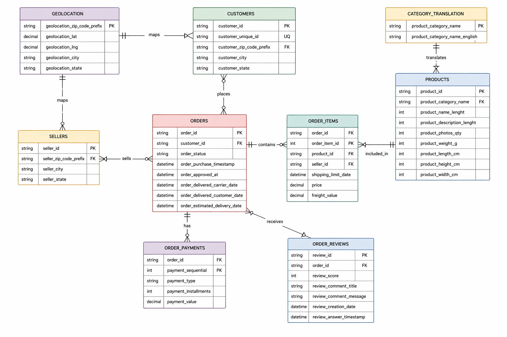
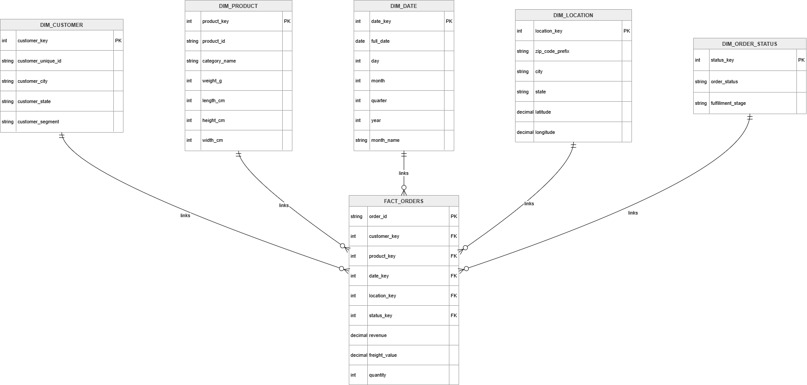

# 🛒 End-to-End E-Commerce Intelligence Analysis
### SQL + Python + Interactive Web Dashboard + Data Modeling Project

---

# 📌 Project Overview

This project is a complete **end-to-end data analytics solution** built on a real-world multi-table e-commerce dataset.

The objective was to analyze:

- Business growth performance  
- Customer purchasing behavior  
- Operational efficiency  
- Long-term growth sustainability  

using **SQL Server, Python, HTML Dashboarding, and Data Modeling concepts**.

Unlike generic student dashboard projects, this project focuses on solving a real business problem:

> **Is business growth driven by loyal repeat customers or only by continuous new customer acquisition?**

---

# 🎯 Business Problem Statement

The e-commerce company showed strong order growth and excellent delivery performance, but it was unclear whether growth was sustainable.

The main goal was to determine:

- Is revenue healthy?
- Are customers returning?
- Is growth acquisition-driven?
- Are operations efficient?
- What actions should the business take?

---

# 💡 Executive Story (Business Summary)

After analyzing **100K+ transactions**, I found:

✅ Strong operational fulfillment (**~97.8% successful deliveries**)  
✅ Growing order volume over time  
⚠️ Only **~5–7% customers returned after their first month**

This indicates that growth depended heavily on acquiring new customers rather than building customer loyalty.

---

# 🧰 Tools & Technologies Used

| Tool | Purpose |
|------|---------|
| SQL Server | Data import, cleaning, joins, transformations |
| Python (Pandas, Matplotlib, Seaborn) | Cohort analysis, retention modeling |
| HTML / CSS / JavaScript | Interactive dashboard visualization |
| AI-assisted Front-End Generation | Accelerated UI dashboard creation |
| Draw.io | ERD & Star Schema design |

---

# 📂 Dataset Information

Real-world public e-commerce dataset containing:

- 100K+ Orders
- Customers
- Products
- Sellers
- Payments
- Reviews
- Geolocation
- Product Translation

---

# 🧱 Data Architecture

---

# 1️⃣ Raw Source ERD

Designed complete relational schema across 9 source tables.

## Source Tables

- Customers
- Orders
- Order Items
- Products
- Sellers
- Payments
- Reviews
- Geolocation
- Category Translation

## Relationship Flow

- Customers → Orders  
- Orders → Order Items  
- Order Items → Products  
- Orders → Payments  
- Orders → Reviews  
- Order Items → Sellers  
- Customers / Sellers → Geolocation  
- Products → Category Translation  

## Why Important?

This demonstrates:

- Relational database understanding
- Multi-table joins
- Transactional schema design
- SQL data modeling maturity

## ERD Preview



---

# 2️⃣ Analytics Star Schema

To simplify reporting and improve dashboard performance, raw data was transformed into an analytics-ready star schema.

## ⭐ Fact Table

### FACT_ORDERS

Measures:

- Revenue
- Freight Cost
- Quantity
- Order Count

Foreign Keys:

- customer_key
- product_key
- date_key
- location_key
- status_key

## 📦 Dimension Tables

- DIM_CUSTOMER
- DIM_PRODUCT
- DIM_DATE
- DIM_LOCATION
- DIM_ORDER_STATUS

## Why Important?

This demonstrates:

- Data warehouse thinking
- BI modeling skills
- Scalable reporting architecture
- Real company analytics workflows

## Star Schema Preview



---

# 🔄 Data Pipeline Flow

```text
CSV Raw Files
     ↓
SQL Server Import
     ↓
Data Cleaning & Joins
     ↓
Master Analytics Table
     ↓
Python Retention Analysis
     ↓
Interactive HTML Dashboard
🧹 SQL Engineering Work

Performed:

Imported 9 CSV source files into SQL Server
Fixed datatype mismatches during loading
Cleaned inconsistent data
Joined multiple source tables
Built reusable ecommerce_master table
Wrote KPI queries for business metrics
📊 SQL Analysis Performed
Revenue Trend

Tracked monthly revenue performance.

Orders Trend

Measured growth in transaction volume.

Average Order Value (AOV)

Analyzed spend per order.

Fulfillment Metrics

Tracked delivered, canceled, shipped, unavailable orders.

🐍 Python Advanced Analytics

Used Python for customer behavior analytics.

Cohort Retention Analysis

Grouped customers by first purchase month and tracked future repeat activity.

Key Result

Only ~5–7% customers returned after Month 1

Meaning:

The business depended more on acquiring new users than retaining existing ones.

🌐 Dashboard Solution

Built an interactive web dashboard (.html) to present business KPIs and insights.

The front-end UI layer was developed using AI-assisted generation and then customized using project requirements and analytics outputs.

Dashboard Includes
Total Revenue KPI
Total Orders KPI
Avg Order Value KPI
Delivery Rate KPI
Revenue Trend
Orders Trend
Fulfillment Status Breakdown
Customer Cohort Retention Analysis
Interactive Filters
Why HTML Dashboard Instead of Tableau?

This project focused on delivering a modern executive-style interactive dashboard experience beyond standard BI templates.

The dashboard uses:

Responsive design
Rich UI styling
Interactive filters
Business presentation layer


🔥 Key Insights Discovered
1. Strong Operations

Delivery success rate was ~97.8%

Meaning logistics processes were efficient.

2. Growth in Orders

Orders increased consistently over time.

3. Weak Retention

Only 5–7% customers returned after first month.

This suggests poor customer loyalty.

4. Risky Growth Model

Growth depended on constant new customer acquisition.

This may increase long-term marketing costs.

💼 Business Recommendations
Improve Retention
Loyalty rewards
Repeat purchase incentives
Personalized offers
Re-engage Users
Email remarketing
Cart recovery campaigns
Increase Order Value
Product bundles
Upselling recommendations
🧠 What I Learned
Revenue growth alone does not guarantee healthy business growth.
Retention is often stronger than acquisition as a success metric.
Proper data models improve dashboard scalability.
Storytelling is as important as technical analysis.
